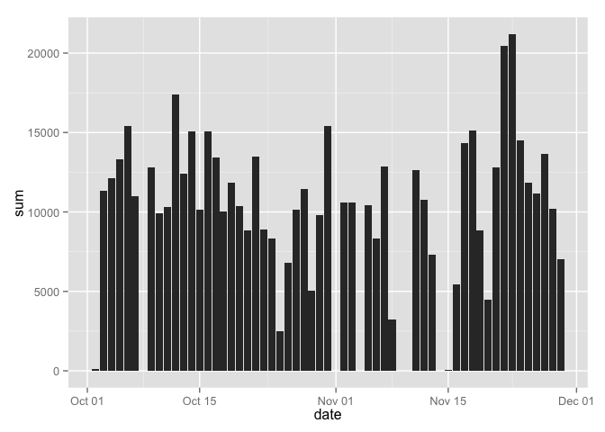
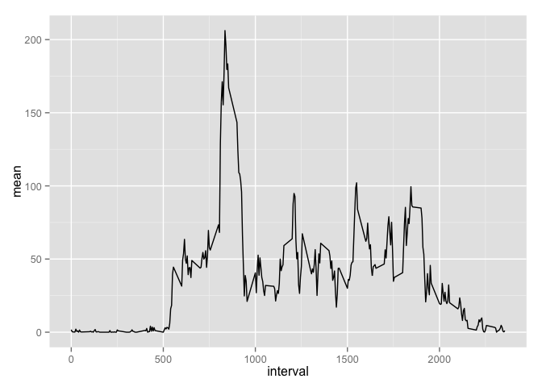
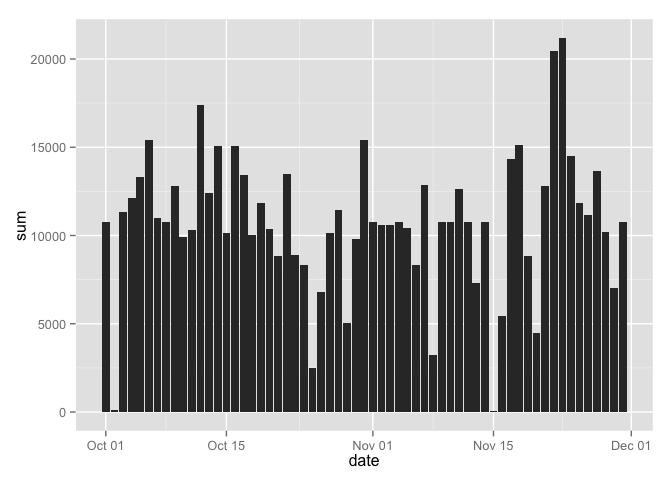
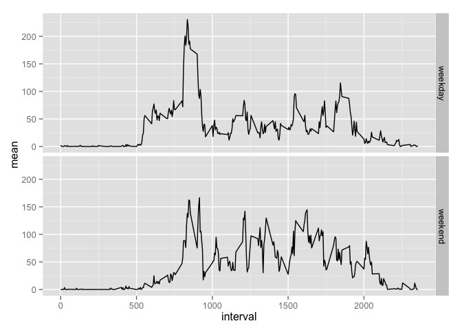

# Reproducible Research: Peer Assessment 1


## Loading and preprocessing the data

```r
library(data.table)
DT = fread("activity.csv")[,date:=as.Date(date)]
```
## What is the mean and total number of steps taken per day?
### Histogram of total steps for each day

```r
library(ggplot2)
sum_stats = na.omit(DT[,list(sum=sum(steps)), by=date])
ggplot(sum_stats, aes(date, sum)) + geom_bar(stat="identity")
```

 

### Table of mean and median steps for each day

```r
center_stats = DT[,list(mean=mean(steps), median=as.double(median(steps))), by=date]
print(center_stats)
```

```
##           date       mean median
##  1: 2012-10-01         NA     NA
##  2: 2012-10-02  0.4375000      0
##  3: 2012-10-03 39.4166667      0
##  4: 2012-10-04 42.0694444      0
##  5: 2012-10-05 46.1597222      0
##  6: 2012-10-06 53.5416667      0
##  7: 2012-10-07 38.2465278      0
##  8: 2012-10-08         NA     NA
##  9: 2012-10-09 44.4826389      0
## 10: 2012-10-10 34.3750000      0
## 11: 2012-10-11 35.7777778      0
## 12: 2012-10-12 60.3541667      0
## 13: 2012-10-13 43.1458333      0
## 14: 2012-10-14 52.4236111      0
## 15: 2012-10-15 35.2048611      0
## 16: 2012-10-16 52.3750000      0
## 17: 2012-10-17 46.7083333      0
## 18: 2012-10-18 34.9166667      0
## 19: 2012-10-19 41.0729167      0
## 20: 2012-10-20 36.0937500      0
## 21: 2012-10-21 30.6284722      0
## 22: 2012-10-22 46.7361111      0
## 23: 2012-10-23 30.9652778      0
## 24: 2012-10-24 29.0104167      0
## 25: 2012-10-25  8.6527778      0
## 26: 2012-10-26 23.5347222      0
## 27: 2012-10-27 35.1354167      0
## 28: 2012-10-28 39.7847222      0
## 29: 2012-10-29 17.4236111      0
## 30: 2012-10-30 34.0937500      0
## 31: 2012-10-31 53.5208333      0
## 32: 2012-11-01         NA     NA
## 33: 2012-11-02 36.8055556      0
## 34: 2012-11-03 36.7048611      0
## 35: 2012-11-04         NA     NA
## 36: 2012-11-05 36.2465278      0
## 37: 2012-11-06 28.9375000      0
## 38: 2012-11-07 44.7326389      0
## 39: 2012-11-08 11.1770833      0
## 40: 2012-11-09         NA     NA
## 41: 2012-11-10         NA     NA
## 42: 2012-11-11 43.7777778      0
## 43: 2012-11-12 37.3784722      0
## 44: 2012-11-13 25.4722222      0
## 45: 2012-11-14         NA     NA
## 46: 2012-11-15  0.1423611      0
## 47: 2012-11-16 18.8923611      0
## 48: 2012-11-17 49.7881944      0
## 49: 2012-11-18 52.4652778      0
## 50: 2012-11-19 30.6979167      0
## 51: 2012-11-20 15.5277778      0
## 52: 2012-11-21 44.3993056      0
## 53: 2012-11-22 70.9270833      0
## 54: 2012-11-23 73.5902778      0
## 55: 2012-11-24 50.2708333      0
## 56: 2012-11-25 41.0902778      0
## 57: 2012-11-26 38.7569444      0
## 58: 2012-11-27 47.3819444      0
## 59: 2012-11-28 35.3576389      0
## 60: 2012-11-29 24.4687500      0
## 61: 2012-11-30         NA     NA
##           date       mean median
```

## What is the average daily activity pattern?
### Time Series Plot

```r
center_stats = DT[,list(mean=mean(steps, na.rm=TRUE)), by=interval]
ggplot(center_stats, aes(interval, mean)) + geom_line()
```

 

### Time interval with maximum mean number of steps

```r
center_stats_max = center_stats[mean==max(mean)]
with(center_stats_max, print(sprintf("max mean is %f at 5-minute interval %g", mean, interval)))
```

```
## [1] "max mean is 206.169811 at 5-minute interval 835"
```

## Imputing missing values

### The number of rows with NA:

```r
nrow(DT[is.na(steps)])
```

```
## [1] 2304
```

### The strategy for filling out the missing number of steps for an interval on a given day will be to take the mean value for that interval across all days.

```r
DT[,c("steps_raw", "steps") := list(steps, as.double(steps))][is.na(steps), steps := center_stats$mean]
```

### Histogram of total steps for each day after missing values were imputed

```r
sum_stats = na.omit(DT[,list(sum=sum(steps)), by=date])
ggplot(sum_stats, aes(date, sum)) + geom_bar(stat="identity")
```

 

### Print table of median and mean for each day before and after imputing

We inserted the mean value across all days as the imputed value for a given interval. This means that for days that already had values, their mean and median hasn't changed, as illustrated by all the zeroes in the `mean_diff` and `median_diff` columns.


```r
options(width=119)
center_stats = DT[,list(mean=mean(steps), 
                        median=as.double(median(steps)), 
                        mean_raw=mean(steps_raw), 
                        median_raw=as.double(median(steps_raw))), by=date]

center_stats[,c("mean_diff","median_diff"):=list(mean-mean_raw,median-median_raw)]
```

```
##           date       mean   median   mean_raw median_raw mean_diff median_diff
##  1: 2012-10-01 37.3825996 34.11321         NA         NA        NA          NA
##  2: 2012-10-02  0.4375000  0.00000  0.4375000          0         0           0
##  3: 2012-10-03 39.4166667  0.00000 39.4166667          0         0           0
##  4: 2012-10-04 42.0694444  0.00000 42.0694444          0         0           0
##  5: 2012-10-05 46.1597222  0.00000 46.1597222          0         0           0
##  6: 2012-10-06 53.5416667  0.00000 53.5416667          0         0           0
##  7: 2012-10-07 38.2465278  0.00000 38.2465278          0         0           0
##  8: 2012-10-08 37.3825996 34.11321         NA         NA        NA          NA
##  9: 2012-10-09 44.4826389  0.00000 44.4826389          0         0           0
## 10: 2012-10-10 34.3750000  0.00000 34.3750000          0         0           0
## 11: 2012-10-11 35.7777778  0.00000 35.7777778          0         0           0
## 12: 2012-10-12 60.3541667  0.00000 60.3541667          0         0           0
## 13: 2012-10-13 43.1458333  0.00000 43.1458333          0         0           0
## 14: 2012-10-14 52.4236111  0.00000 52.4236111          0         0           0
## 15: 2012-10-15 35.2048611  0.00000 35.2048611          0         0           0
## 16: 2012-10-16 52.3750000  0.00000 52.3750000          0         0           0
## 17: 2012-10-17 46.7083333  0.00000 46.7083333          0         0           0
## 18: 2012-10-18 34.9166667  0.00000 34.9166667          0         0           0
## 19: 2012-10-19 41.0729167  0.00000 41.0729167          0         0           0
## 20: 2012-10-20 36.0937500  0.00000 36.0937500          0         0           0
## 21: 2012-10-21 30.6284722  0.00000 30.6284722          0         0           0
## 22: 2012-10-22 46.7361111  0.00000 46.7361111          0         0           0
## 23: 2012-10-23 30.9652778  0.00000 30.9652778          0         0           0
## 24: 2012-10-24 29.0104167  0.00000 29.0104167          0         0           0
## 25: 2012-10-25  8.6527778  0.00000  8.6527778          0         0           0
## 26: 2012-10-26 23.5347222  0.00000 23.5347222          0         0           0
## 27: 2012-10-27 35.1354167  0.00000 35.1354167          0         0           0
## 28: 2012-10-28 39.7847222  0.00000 39.7847222          0         0           0
## 29: 2012-10-29 17.4236111  0.00000 17.4236111          0         0           0
## 30: 2012-10-30 34.0937500  0.00000 34.0937500          0         0           0
## 31: 2012-10-31 53.5208333  0.00000 53.5208333          0         0           0
## 32: 2012-11-01 37.3825996 34.11321         NA         NA        NA          NA
## 33: 2012-11-02 36.8055556  0.00000 36.8055556          0         0           0
## 34: 2012-11-03 36.7048611  0.00000 36.7048611          0         0           0
## 35: 2012-11-04 37.3825996 34.11321         NA         NA        NA          NA
## 36: 2012-11-05 36.2465278  0.00000 36.2465278          0         0           0
## 37: 2012-11-06 28.9375000  0.00000 28.9375000          0         0           0
## 38: 2012-11-07 44.7326389  0.00000 44.7326389          0         0           0
## 39: 2012-11-08 11.1770833  0.00000 11.1770833          0         0           0
## 40: 2012-11-09 37.3825996 34.11321         NA         NA        NA          NA
## 41: 2012-11-10 37.3825996 34.11321         NA         NA        NA          NA
## 42: 2012-11-11 43.7777778  0.00000 43.7777778          0         0           0
## 43: 2012-11-12 37.3784722  0.00000 37.3784722          0         0           0
## 44: 2012-11-13 25.4722222  0.00000 25.4722222          0         0           0
## 45: 2012-11-14 37.3825996 34.11321         NA         NA        NA          NA
## 46: 2012-11-15  0.1423611  0.00000  0.1423611          0         0           0
## 47: 2012-11-16 18.8923611  0.00000 18.8923611          0         0           0
## 48: 2012-11-17 49.7881944  0.00000 49.7881944          0         0           0
## 49: 2012-11-18 52.4652778  0.00000 52.4652778          0         0           0
## 50: 2012-11-19 30.6979167  0.00000 30.6979167          0         0           0
## 51: 2012-11-20 15.5277778  0.00000 15.5277778          0         0           0
## 52: 2012-11-21 44.3993056  0.00000 44.3993056          0         0           0
## 53: 2012-11-22 70.9270833  0.00000 70.9270833          0         0           0
## 54: 2012-11-23 73.5902778  0.00000 73.5902778          0         0           0
## 55: 2012-11-24 50.2708333  0.00000 50.2708333          0         0           0
## 56: 2012-11-25 41.0902778  0.00000 41.0902778          0         0           0
## 57: 2012-11-26 38.7569444  0.00000 38.7569444          0         0           0
## 58: 2012-11-27 47.3819444  0.00000 47.3819444          0         0           0
## 59: 2012-11-28 35.3576389  0.00000 35.3576389          0         0           0
## 60: 2012-11-29 24.4687500  0.00000 24.4687500          0         0           0
## 61: 2012-11-30 37.3825996 34.11321         NA         NA        NA          NA
##           date       mean   median   mean_raw median_raw mean_diff median_diff
```

## Are there differences in activity patterns between weekdays and weekends? YES!

### Create a new weekday/weekend factor variable

```r
weekend = c("Saturday", "Sunday")
levels = c(FALSE,TRUE)
labels = c("weekday", "weekend")
DT[,w:=factor(weekdays(date) %in% weekend, levels, labels)]
```

### Graph weekday vs. weekend

```r
center_stats = DT[,list(mean=mean(steps, na.rm=TRUE)), by=c("interval","w")]
ggplot(center_stats, aes(interval, mean)) + geom_line() + facet_grid(w ~ .)
```

 
